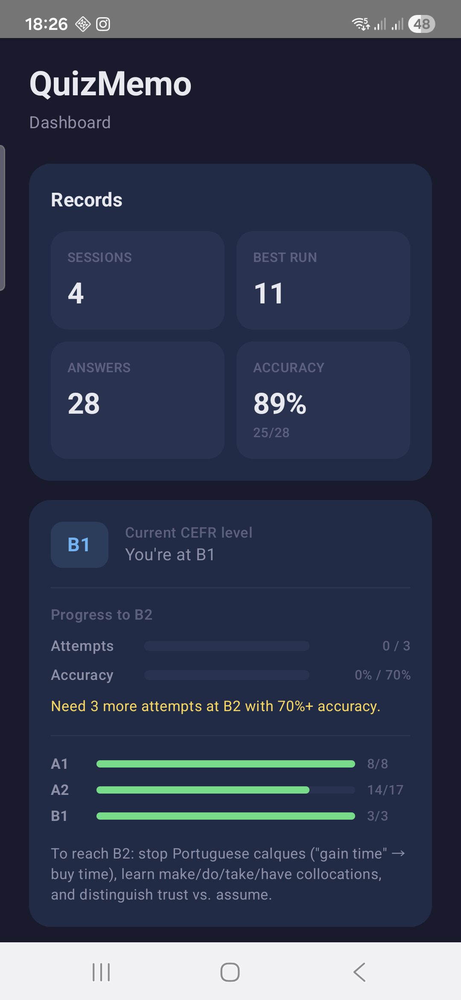
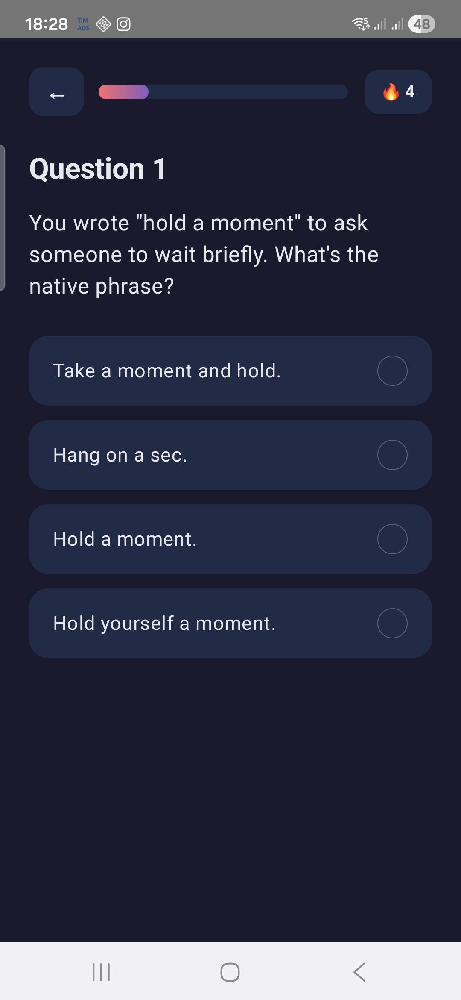
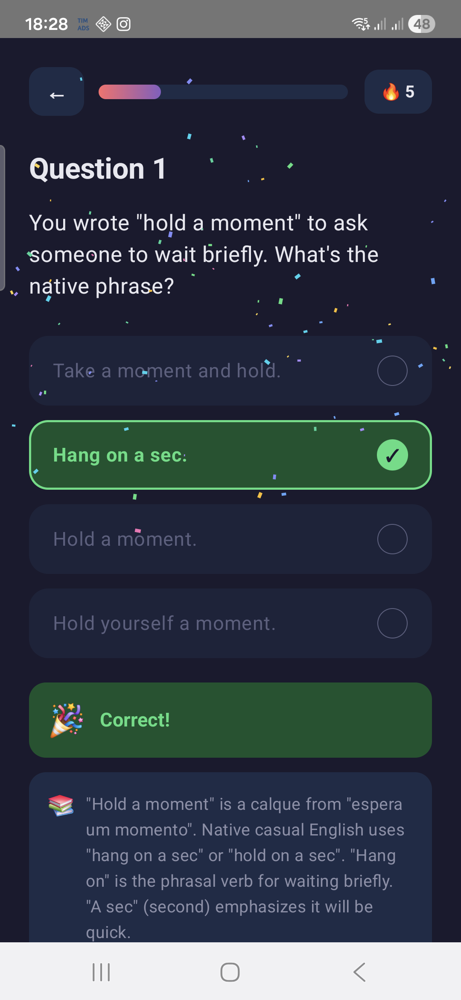
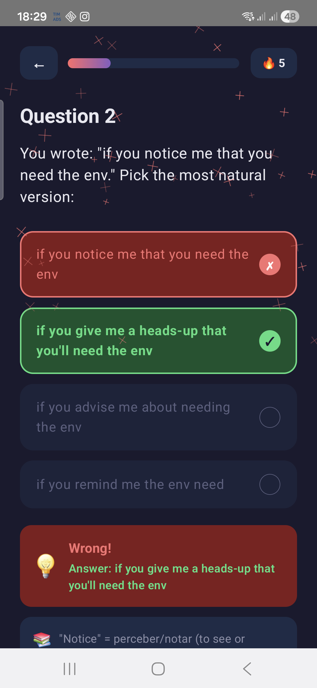

<div align="center">

# QuizMemo

**A daily spaced-repetition quiz for English phrasing drills.**
Native Android (Kotlin + Jetpack Compose) with an optional .NET 10 backend.

[](https://dotnet.microsoft.com/)
[](https://kotlinlang.org/)
[](https://developer.android.com/jetpack/compose)
[](https://www.postgresql.org/)
[](https://docs.docker.com/compose/)
[](https://learn.microsoft.com/ef/core/)

</div>

---

One session per day. One wrong answer ends the run. Every correct answer is a point; well-known questions sink to the bottom of the deck, fresh and weak ones float to the top. A CEFR estimator tells you what band you're on and what to drill next.

## Screenshots

<p align="center">
  
  
  
  
</p>

<p align="center"><em>Dashboard · In-session · Correct · Wrong</em></p>

## Highlights

- **Daily session, one miss ends the run.** The server-side rule means the client can't cheat it.
- **Unlimited replays.** Each retry starts a fresh session attempt; historical answers still feed the estimator and the ordering.
- **Spaced-repetition ordering.** Next question = never-answered first → then most errors → then fewest corrects.
- **CEFR estimator.** Highest band where you have ≥ 3 attempts AND ≥ 70 % accuracy, with all lower bands passed. Stops at the first failure — no cherry-picking.
- **Offline mode.** Flip one flag and the app runs entirely locally with 105 bundled English drills and persistent JSON state.
- **Google Sign-In.** Credential Manager → backend ID-token validation → short-lived JWT.

## Tech stack

<table>
<tr>
<td>

**Android**

- Kotlin + Jetpack Compose (Material 3)
- Retrofit + OkHttp
- kotlinx.serialization
- Credential Manager + Google Identity

</td>
<td>

**Backend**

- ASP.NET Core 10 minimal API
- EF Core + Npgsql
- JWT (HS256) + Google token validation
- Dockerfile + docker-compose

</td>
<td>

**Data**

- PostgreSQL 16
- EF Core migrations
- `.example.sql` + `.local.sql` seed split
- 105 bundled offline questions

</td>
</tr>
</table>

## Architecture

```
┌──────────────────────────┐       ┌────────────────────────┐       ┌──────────────┐
│  Android (Compose)       │ HTTPS │  ASP.NET Core 10 API   │  SQL  │  Postgres 16 │
│                          │ ────► │                        │ ────► │              │
│  QuizRepository          │       │  /quiz/next            │       │  Questions   │
│    ├─ ApiClient (online) │       │  /quiz/answer          │       │  Answers     │
│    └─ LocalQuiz (offline)│       │  /quiz/dashboard       │       │  Users       │
└──────────────────────────┘       └────────────────────────┘       └──────────────┘
```

The Android app talks to the backend through a single `QuizRepository` facade. Flipping `QuizRepository.OFFLINE` to `true` routes every call to `LocalQuiz`, which holds state in-process and persists it as JSON in `filesDir/local_quiz_state.json`. The backend stays untouched — same DTOs, same semantics.

See [`CLAUDE.md`](CLAUDE.md) for the deep dive on each module.

## Quick start

<details>
<summary><strong>Offline-only (Android Studio)</strong></summary>

No backend needed.

1. `git clone https://github.com/alexssandro/quizmemo.git`
2. Open `android/` in Android Studio.
3. Copy `android/local.properties.example` → `android/local.properties` — for offline mode you can leave the API URL and Google client ID untouched.
4. Run on an emulator (Pixel 5+ API 34) or a physical device. `QuizRepository.OFFLINE` is already `true`.

</details>

<details>
<summary><strong>Full stack (backend + Android)</strong></summary>

Requires Docker Desktop and JDK 17+.

```bash
# 1. Env file with Postgres/JWT/Google client ID
cp .env.example .env
$EDITOR .env

# 2. Bring up Postgres + API
docker compose up --build

# 3. Seed questions
docker exec -i quizmemo-postgres psql -U quizmemo -d quizmemo < db/seed_english.example.sql

# 4. Android — point at your LAN IP
cp android/local.properties.example android/local.properties
$EDITOR android/local.properties    # quizmemo.api.baseUrl + quizmemo.google.webClientId
```

Flip `QuizRepository.OFFLINE` to `false` in `android/app/src/main/java/com/quizmemo/network/QuizRepository.kt` to route calls through the API.

</details>

<details>
<summary><strong>Backend only (dotnet run)</strong></summary>

```bash
cd backend/QuizMemo.Api

dotnet user-secrets set "Jwt:Key" "<at-least-32-random-chars>"
dotnet user-secrets set "ConnectionStrings:Postgres" "Host=localhost;Port=5432;Database=quizmemo;Username=quizmemo;Password=..."
dotnet user-secrets set "Google:ClientId" "<web-oauth-client-id>.apps.googleusercontent.com"

dotnet ef migrations add Initial    # first time only
dotnet run
```

Binds `http://0.0.0.0:5080` by default so a phone on the same LAN can reach it.

</details>

## The rules behind the screen

### Next-question ordering

```text
1. Questions you've never answered        (sort first)
2. Questions with the most historical errors (descending)
3. Questions with the fewest historical corrects (ascending)
```

Well-known questions naturally drift to the back. New or weak ones keep surfacing.

### CEFR level estimation

```text
for level in [A1, A2, B1, B2, C1, C2]:
    if attempts >= 3 AND accuracy >= 70 %:
        estimated = level
    else:
        break                 # gap-stopping: we trust curriculum order
```

Strong at C1 but untested at B2? You stay at the highest *passed* band. No cherry-picking wins past a gap.

### Session semantics

| State                | Behavior                                                |
| -------------------- | ------------------------------------------------------- |
| Never played today   | `/quiz/next` returns the top-ranked question.           |
| Mid-session          | Continue answering, each correct = +1 point.            |
| One wrong answer     | Session ends; `/quiz/next` returns `null`.              |
| Want to replay       | `POST /quiz/session/reset` bumps `SessionAttempt`.      |
| History across runs  | All attempts contribute to ordering + CEFR estimation.  |

## Project layout

```
QuizMemo/
├── android/
│   └── app/src/main/java/com/quizmemo/
│       ├── network/      Retrofit client + QuizRepository facade
│       ├── offline/      LocalQuiz + bundled 105-question bank
│       ├── auth/         Google Sign-In wrapper
│       └── ui/           Compose screens (Dashboard, Quiz, Login)
├── backend/
│   └── QuizMemo.Api/
│       ├── Endpoints/    /auth/* and /quiz/* minimal-API handlers
│       ├── Entities/     EF Core POCOs
│       ├── Quiz/         SessionState + CEFR rules
│       └── Migrations/   EF Core schema history
├── db/
│   ├── seed.sql                   Generic trivia scaffold
│   ├── seed_english.example.sql   Committed template (8 questions)
│   └── seed_english.local.sql     (gitignored) your real bank
├── scripts/
│   └── generate_bundled_questions.py   SQL → Kotlin bank regen
└── docker-compose.yml
```

## Secrets hygiene

All real secrets live in **three independent gitignored stores** — the repo ships with none.

| Store | What lives there | Commit status |
| ----- | ---------------- | ------------- |
| `.env` | Postgres password, JWT key, Google client ID (for docker-compose) | **ignored** (`.env.example` is the committed template) |
| `%APPDATA%\Microsoft\UserSecrets\<id>\secrets.json` | Same three, for `dotnet run` | outside the repo entirely |
| `android/local.properties` | API base URL, Google Web Client ID | **ignored** (`.local.properties.example` is the template) |

Rotation rule: change a secret → update all three stores. Grep the repo for the old value before committing; it should only appear in ignored paths.

## Contributing / extending

- **Add questions** — edit `db/seed_english.local.sql` with the SQL template, then:
  ```bash
  python scripts/generate_bundled_questions.py db/seed_english.local.sql \
      > android/app/src/main/java/com/quizmemo/offline/BundledQuestions.kt
  ```
  That keeps the offline bank in sync with the server seed.
- **Tune the estimator** — `backend/QuizMemo.Api/Quiz/CefrLevels.cs` (`MinAttempts`, `PassThreshold`). Mirror changes in `LocalQuiz.kt`.
- **New schema changes** — `dotnet ef migrations add <Name>` from `backend/QuizMemo.Api/`. Auto-applies on startup.

## License

Not yet published. Treat as "all rights reserved" until a `LICENSE` file lands here.
